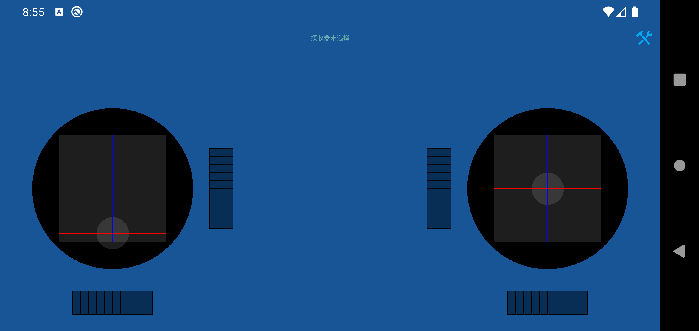
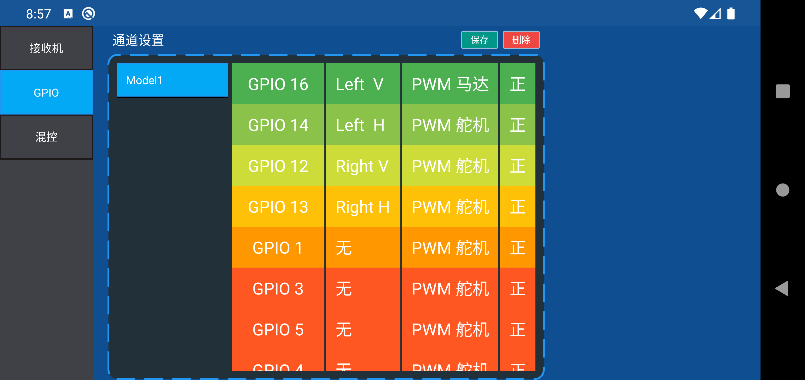

# open-rc-android

### 主要功能
#### 1 通道映射设置 
#### 2 最多支持7通道 
#### 3 通道微调
#### 4 通道可以设置 PWM模式：直驱（一般控制MOSFET管）、舵机
#### 5 通道反转
#### 6 电压回传

#### 待开发混控、通道回中自定义...

欢迎大家有好的需求尽量提出来，我会抽时间实现

### 使用步骤
#### 1.手机新建热点，这个热点是用来接收机来连接的，控制端和接收机基于局域网UDP通信。
#### 2.接收机烧录进 open-rc-esp代码 
#### 3.给接收机供电，接受机会自动连接此网络
#### 4.在接收机设置页选择要控制的接收机（可以多选，同时控制）

### 应用截图

Watch the video (https://www.bilibili.com/video/BV1NZ4y1F7ZE?spm_id_from=333.999.0.0)

[遥控小车](https://www.bilibili.com/video/BV1zY41187JN/)

[电磁舵机控制](https://www.bilibili.com/video/BV1BF411q7JE/)

### 应用文件 [APK](app/release/app-release.apk)
